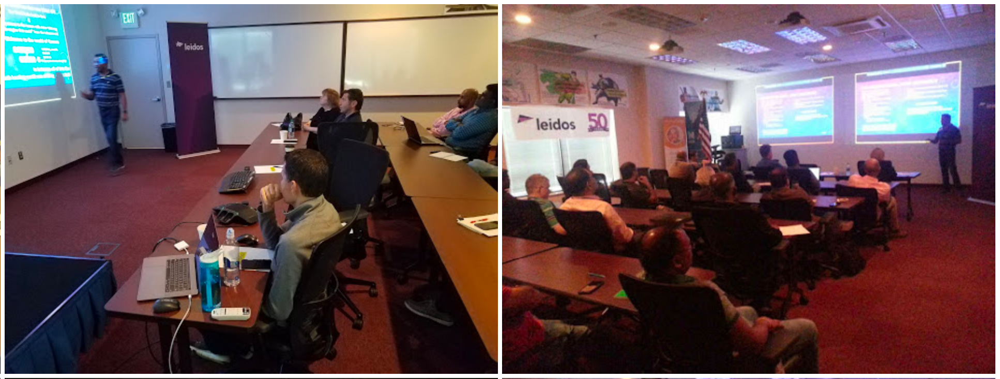

This repository contains the demo portion of the talk I gave in 2019 on "Understanding Micro Services" to a group of about 125+ people.

### Screenshot ###


### Understanding Microservices (using Cote.js)

## Getting started

```
# git clone this project
cd understanding-microservices-demo 
npm install
# window-1
node server-web/index
# window-2
node services/welcome-service
# window-3
node services/welcome-service
```

See Powerpoint and PDF slide deck for details.
